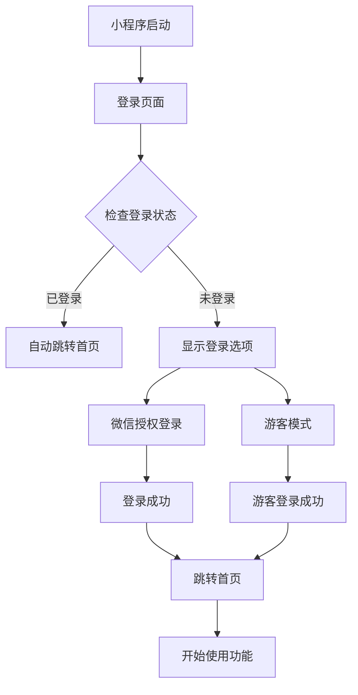

# 登录优先流程说明

## 🔄 **新的用户流程**

### **调整后的启动流程：**
1. **小程序启动** → 直接进入登录页面
2. **用户选择登录方式**：
   - 💬 **微信授权登录**：获得完整功能和云端同步
   - 👤 **游客模式继续**：体验基础功能
3. **登录成功** → 自动跳转到绘图首页
4. **开始使用** → 所有功能正常使用

## ✅ **已完成的调整**

### 1. 修改首页配置
```json
// app.json - 将登录页面设为首页
{
  "pages": [
    "pages/login/login",  // 🔝 现在是首页
    "pages/index/index",
    "pages/result/result",
    "pages/creative/creative", 
    "pages/profile/profile"
  ]
}
```

### 2. 优化登录页面逻辑
```javascript
// login.js - 登录成功后的跳转逻辑
✅ 微信登录成功 → wx.reLaunch({ url: '/pages/index/index' })
✅ 游客登录成功 → wx.reLaunch({ url: '/pages/index/index' })
✅ 已登录用户 → 自动跳转到首页（500ms延迟确保初始化完成）
```

### 3. 移除冗余功能
```javascript
// 删除了以下不再需要的功能：
❌ 首页的"测试登录功能"按钮（WXML + JS + CSS）
❌ Profile页面的goToLogin方法
✅ 现在登录是必需的启动步骤
```

## 🎯 **用户体验优化**

### **对新用户：**
- 🚪 **明确的入口**：启动即看到登录选项
- 🎯 **引导清晰**：不会迷失在功能页面中
- 🔐 **数据安全**：确保用户身份明确

### **对老用户：**
- ⚡ **快速通过**：已登录用户自动跳转
- 💾 **数据保持**：用户信息自动恢复
- 🔄 **无缝体验**：登录后直接到绘图页面

### **对游客用户：**
- 👤 **快速体验**：游客模式保持可用
- 🎨 **功能体验**：可以体验基础绘图功能
- ⬆️ **升级引导**：随时可以升级为正式用户

## 📱 **新的使用场景**

### **首次使用：**
```
1. 打开小程序 → 登录页面
2. 选择"微信授权登录" → 授权确认
3. 登录成功提示 → 自动跳转首页  
4. 开始使用绘图功能
```

### **体验用户：**
```
1. 打开小程序 → 登录页面
2. 选择"游客模式继续" → 立即进入
3. 自动跳转首页 → 开始体验
4. 需要时可在Profile页面升级账号
```

### **老用户：**
```
1. 打开小程序 → 登录页面（快速检查）
2. 检测到已登录 → 自动跳转首页
3. 直接使用所有功能
```

## 🔧 **技术实现细节**

### **登录状态检查**
```javascript
// login.js onLoad() 
setTimeout(() => {
  if (app.globalData.userInfo) {
    console.log('用户已登录，跳转到首页')
    wx.reLaunch({ url: '/pages/index/index' })
  }
}, 500) // 给app初始化留出时间
```

### **登录成功跳转**
```javascript
// 统一使用 wx.reLaunch 确保清除页面栈
wx.reLaunch({
  url: '/pages/index/index'
})
```

### **兼容性处理**
- ✅ 处理app.js初始化时序问题
- ✅ 确保用户数据完整性
- ✅ 保持原有的错误处理机制

## 🎨 **UI/UX 改进**

### **登录页面**
- 🎨 保持现有的精美设计
- 💬 清晰的权限说明
- ⚡ 快速的加载体验

### **绘图页面**
- 🧹 移除了"测试登录"按钮
- 🎯 更专注于核心功能
- 📊 用户状态信息依然显示

## 📊 **数据流程**



## 🚀 **预期效果**

### **用户体验：**
- 📈 **转化率提升**：明确的登录引导
- ⚡ **使用效率**：减少迷失和困惑
- 🔐 **数据安全**：用户身份明确管理

### **开发维护：**
- 🧹 **代码简化**：移除冗余的登录入口
- 🔧 **逻辑清晰**：统一的用户状态管理
- 🐛 **减少bug**：避免多入口的状态不一致

## 📝 **使用建议**

1. **重新编译上传代码**
2. **清除手机端缓存**
3. **重新扫码测试完整流程**
4. **验证新老用户体验**
5. **确认游客模式正常**

现在用户将获得更流畅、更安全的使用体验！🎉 